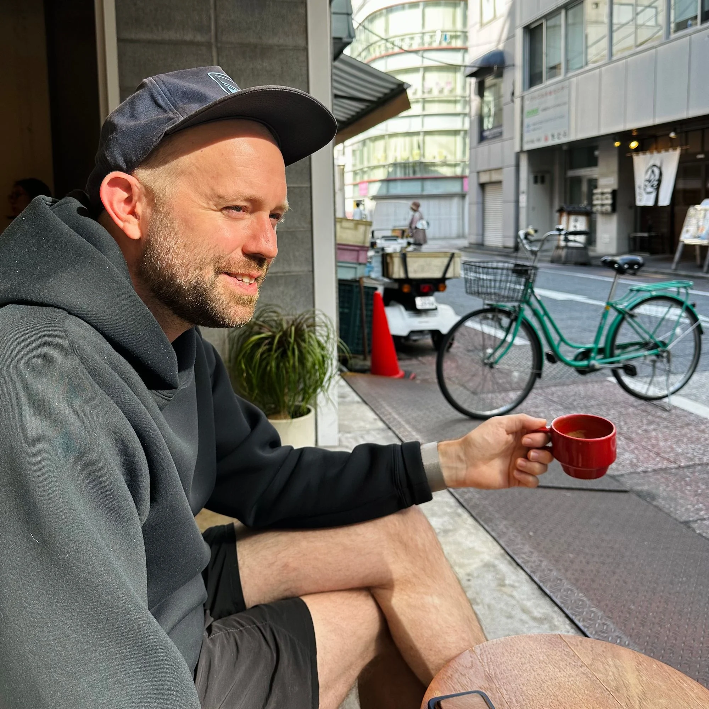

## About Me

My name is Michael Warren（マイケル・ウォーレン）

-----|-------|--------
1984–2004 | Minnesota
2004–2009 | California
2009–2014 | Aomori
2015–2016 | Tokyo
2017–2020 | Tokyo ⇄ Aomori
2020–2022 | Aomori
2023– | Tokyo

## Background

1984年、アメリカ・ミネソタ州生まれ。カリフォルニア大学ロサンゼルス校卒業。2009年に青森県へ。2016年にアレックス・クイーン氏と株式会社Queen & Co.を共同設立。十和田市現代美術館の広報をはじめ、翻訳等の言語サービス、DXによる業務改善事業を手がける。五戸国際ミュージックフェスティバル主催やDJ等、自身の音楽活動も精力的に行なっている。

After 19 years in Minnesota, I spent the first half of my 20s in California. I graduated from [UCLA](http://www.ucla.edu/) and spent the second half of my 20s in Aomori, in Northern Japan. 

I currently split my time between Tokyo and Aomori.

    - [Queen & Co.](https://www.queenand.co/) co-founder
    - [Long Now](http://longnow.org/) member #3602
    - DJ / Song selector and maker of mixes
    - Music man in a handful of bands
    - Snapping away on [Instagram](https://instagram.com/themichaelwarren)

---

> "How we spend our days is, of course, how we spend our lives.
What we do with this hour, and that one, is what we are doing.
A schedule defends from chaos and whim. It is a net for catching days.”

